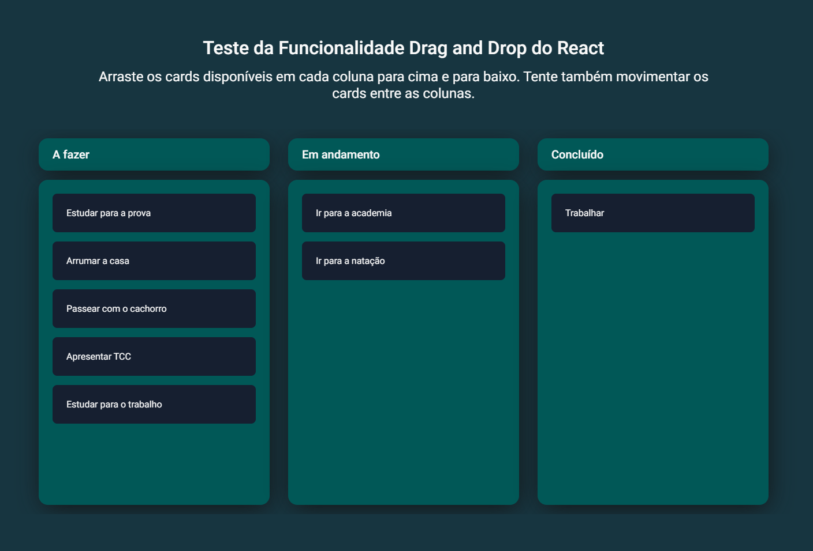
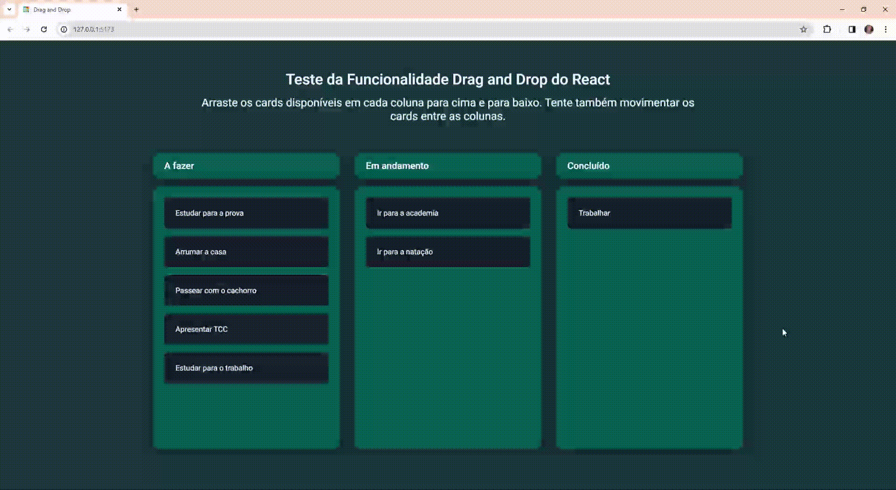

<p align="center">
  
</p>

## 🎉 Let's go!

Para iniciar o projeto insira o comando:
```
npm run dev
```
ou entre no link:
```

```


## 🎥 Demonstração 




## 💻 Projeto

Uma página simples para exemplificar o uso da funcionalidade de Drag and Drop no React.


## 🚀 Tecnologias

Esse projeto foi desenvolvido com as seguintes tecnologias:

- HTML e CSS
- Typescript
- React
- Node e NPM
- Vite


## 📚 Bibliotecas

- React DnD
- Styled Components
